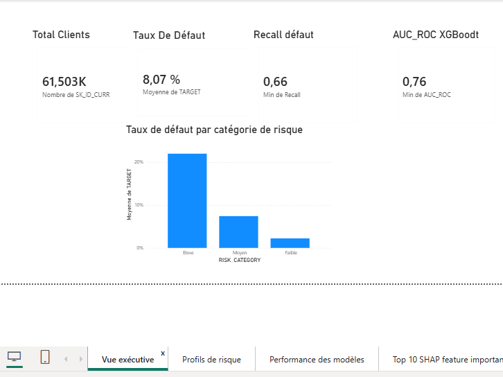
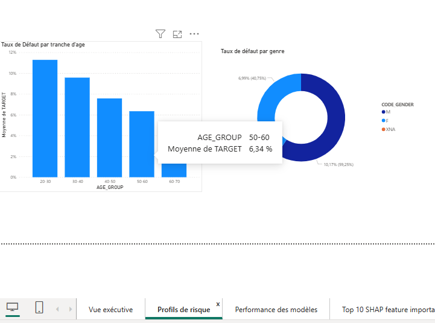
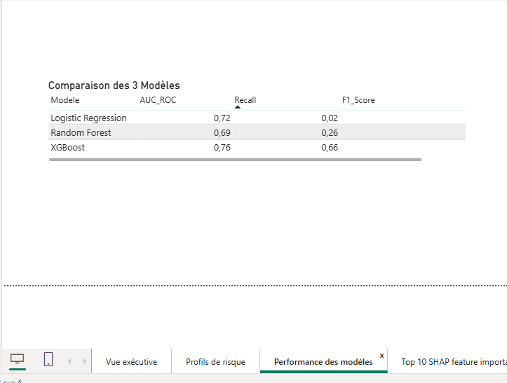
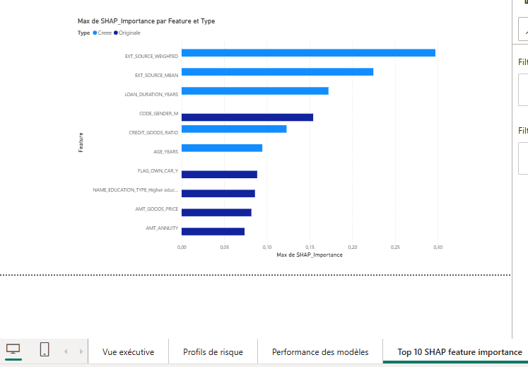

# Credit Risk Prediction 🏦

## Contexte
Prédiction de la probabilité de défaut de paiement  
307 511 clients · 122 variables · 8 tables · Kaggle Competition

## 🚀 Application Live
[](https://https://credit-risk-prediction-crp.streamlit.app)

## Stack technique
Python · XGBoost · SHAP · scikit-learn · SMOTE · Pandas · Seaborn · Power BI

## Résultats
| Modèle | AUC-ROC | Recall Défaut |
|--------|---------|---------------|
| Logistic Regression | 0.7209 | 2.22% |
| Random Forest | 0.6916 | 26.22% |
| **XGBoost ✓** | **0.7646** | **65.98%** |

## Structure du projet
- Phase 1 : EDA & Nettoyage (122 → 75 colonnes)
- Phase 2 : Feature Engineering (11 nouvelles variables créées)
- Phase 3 : Modélisation ML (3 modèles comparés)
- Phase 4 : Interprétabilité SHAP
- Phase 5 : Recommandations business
- Phase 6 : Dashboard Power BI (Star Schema — 3 tables)

## Top 5 drivers du défaut (SHAP)
1. EXT_SOURCE_WEIGHTED (score externe composite — créé)
2. EXT_SOURCE_MEAN (moyenne scores externes — créé)
3. LOAN_DURATION_YEARS (durée du prêt — créé)
4. CODE_GENDER_M (genre masculin)
5. CREDIT_GOODS_RATIO (ratio crédit/valeur bien — créé)
## Dashboard Power BI
4 pages interactives construites sur les vrais résultats du modèle XGBoost :




 

Modélisation des données : Star Schema
- `Fact_Clients` — 61 503 clients avec scores de risque réels
- `Dim_Modeles` — comparaison des 3 modèles
- `Dim_SHAP` — top 10 features SHAP

📊 [Télécharger le dashboard Power BI](Credit_Risk_Dashboard_Lynda.pbix)

## Notebook Kaggle
[Voir le notebook en ligne](https://www.kaggle.com/code/tawhida-lab/credit-risk-prediction-lynda)

## Comment reproduire
1. Accepter les règles sur kaggle.com/c/home-credit-default-risk
2. Ouvrir le notebook Kaggle
3. Run All
4. Télécharger les CSV depuis Output
5. Ouvrir `Credit_Risk_Dashboard_Lynda.pbix`

## Fichiers du repo
```
credit-risk-prediction/
├── credit-risk-prediction.ipynb
├── Credit_Risk_Dashboard_Lynda.pbix
├── images/
│   ├── vue_executive.png
│   ├── profils_risque.png
│   ├── performance_modeles.png
│   └── shap_importance.png
└── README.md
```

## Dataset
[Home Credit Default Risk — Kaggle](https://www.kaggle.com/c/home-credit-default-risk)
